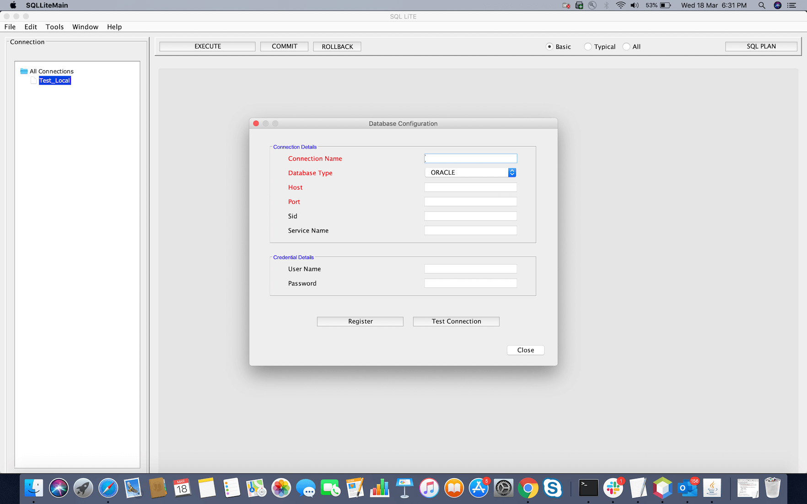

## Summary

SQL LiTE, as the name suggest, is a light-weight tool that acts as a SQL client. It allows database users to do their database tasks in fewer clicks. Note that this is not an IDE. It helps you navigating through various db objects, perform any kind of DML queries, view the result on a graphical user interface.

There was a time (during monolothic days) when most of the business logic used to lie with database in the form of procedure/trigger/functions, etc. Therefore developers had to have a sophisticated and powerful IDE to work with PL/SQL procedure, functions, etc. Of late, people started building more scalable system, thus moving the business logic from DB layer to application layer (separating the compute from storage), thus no longer having the need of such heavy weight IDEs. 

SQL Lite offers a simple GUI to view the table data or performing trivial DML operation. Although compilation of procedure/packages/views/triggers, etc are supported, but not encouraged.

## How to run

1. Create a directory sql-lite.
1. Checkout the **lib** and **deploy** directory. **lib** directory contains libraries (client jars) for different RDBMS systems.
1. Run using the command:
```
java $DEBUG_OPTS -jar deploy/sql-lite-1.0-SNAPSHOT.jar
```

It opens a UI.
From menu option, click **File->Create New Connection** , and a small dialog box will appear. Provide the required details, save it. You will notice the new configurationn appearing on the left panel (under "All Connections").
Right click on the node and click on **Openn Worksheet**, it will open a new work panel for you. 

## Supports

As of today, all following major RDBMS systems are supported:
* **Oracle**
* **DB2**
* **Sybase**
* **Derby**

The client library will be uploaded for DB2 and Sybase.

## Future Plan
Supports the following NoSql DBs:
* **Couchbase**
* **Cassandra**

## Appendix A

Configuration Panel.


